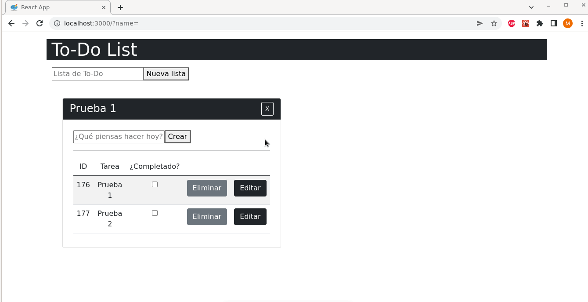

# KATA Full Stack

En el siguiente proyecto se presenta algunos conceptos de Full Stack, trabajando con Spring Boot + ReactJS.

En este link se encuentra un video explicativo del proyecto:
https://www.youtube.com/watch?v=x7eT6B0cVZc

## Demo

#### Se tiene un formulario donde se registra una serie de actividades o To-Dos. Cada actividad tiene una lista de tareas necesarias para completar la actividad.

### Issues

#### 1) La base de datos debe estar en un servidor como MySQL.
#### Solución: Se almacenan los datos del API en un servidor local MySQL, con ayuda de la herramienta de Spring Boot. En la base de datos se crea una tabla llamada todo(donde se almacenan las tareas de cada TO-Do) y otra tabla llamada todo_list (donde se almacenan todos los TO-DOs), y se aplica la relación @ManyToOne

#### 2) Aplicar reglas para no guardar elementos vacios.

#### Solución: Al momento en que el usuario haga la petición para ingresar un nuevo registro, si el campo de entrada está vacio, no se guarda nungún cambio y el usuario recibe una alerta.

#### 3) Validar carácteres y demás para guardar las entidades de los TO-DO.

#### 4) Trabajar con objeto de trasporte de datos o objeto plano para representa los datos ante la API.

#### Solución: En las siguientes peticiones del API se puede observar que se está trabajando con objetos planos:

#### 5) Resolver el diseño gráfico.
#### Solución: Con ayuda de la herramienta bootstrap se agrega estilos a las tablas, formularios y modales, como se puede observar en el anterior demo.
#### 6) Separar bien los elementos gráficos como componentes, store, reducer y providers.
#### Solucion:  En la parte del front, se trató en la medida de lo posible dejar los componenetes en estado puro, es decir unicamente ingresar en ellos todo lo relacionado a las vistas, para esto se dividió el proyecto en 1)controladores donde se ingresa la lógica principal de la aplicación, 2)estado donde se almacenan los datos necesarios para que la aplicación funcione y finalmente los 3)controladores que son los que contienen las vistas.

### Aclaraciones de uso:

#### 1) Puedes usar el comando -> https://github.com/Pilar89/kata-crud-refactoring.git para clonar el proyecto en tu equipo.

#### - Para la carpeta  front
#### 1) Para instalar las dependencias, en el directorio del proyecto usa el comando -> npm install
#### 2) Para correr el proyecto -> npm run
#### 3) Abrir [http://localhost:3000] en el navegador, donde correrá el proyecto

#### - Para la carpeta  front

#### 1) Si se va a trabajar con MySQL local se recomienda ingresar a la carpeta src -> main -> resources -> application.properties y modificar el siguiente archivo según corresponda:

